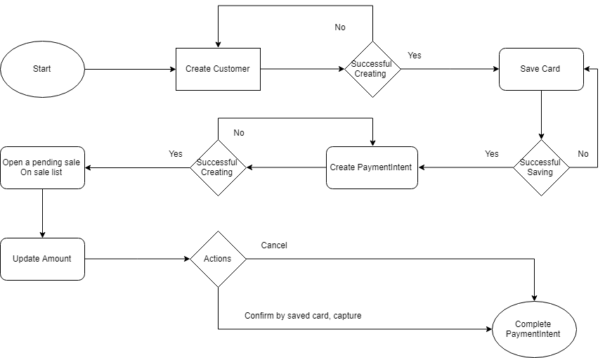

# Stripe Terminal JS Demo

Use this demo app to familiarize yourself with the Stripe Terminal JS SDK before starting your own integration. 
#####Gratuity flow


**You can see this demo app running on [stripe-terminal-demo](https://ezerway.com/stripe-terminal/index.html)**\
Backend demo URL: https://stripe-terminal-api.herokuapp.com

To use the demo, you'll need to deploy our example backend. Navigate to our [example backend](https://github.com/hungnt167/example-terminal-backend.git), and click the button on the Readme to deploy it for free on Heroku with your Stripe API key.

## Running locally

If you prefer running the example app locally, you can run the following commands:
```
npm install
npm run start
```

